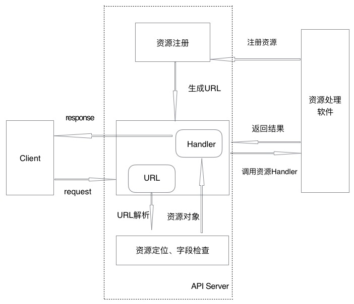

rest api
======
# 概要
api server 会使用注册的资源schema及schema之间父子关系，自动生成url并监听，资源schema包含字段属性定义和rest请求对应的handler函数调用，当收到client的url请求后，api server 解析url并定位资源，检查资源字段有效性，并调用相应的资源handler函数处理，最后将返回结果应答给client。

# 架构

# 详细设计
*  资源定义
	* api server提供Resource接口，用来设置或获取资源基础属性
	
			type Resource interface {
    			GetParent() Resource
    			SetParent(Resource)
    			GetID() string
    			SetID(string)
    			GetLinks() map[ResourceLinkType]ResourceLink
    			SetLinks(map[ResourceLinkType]ResourceLink)
    			GetCreationTimestamp() time.Time
    			SetCreationTimestamp(time.Time)
    			GetSchema() Schema
    			SetSchema(Schema)
    			SetType(string)
    			GetType() string
    			GetAction() *Action
    			SetAction(*Action)
			}
	
    * api server提供ResourceKind接口，用来获取资源所有父资源、创建资源默认值、生成资源支持的Action
		
			type ResourceKind interface {
    			GetParents() []ResourceKind
    			CreateDefaultResource() Resource
    			CreateAction(name string) *Action
			}
			
			type Action struct {
				Name  string      `json:"name"`
				Input interface{} `json:"input,omitempty"`
			}

    * api server 提供ResourceBase基础资源对象，实现Resource和ResourceKind接口，每个资源的定义必须包含ResourceBase，如果有必要，资源需要实现ResourceKind接口提供的函数，即子资源需要实现GetParents函数，确定其父资源，如果资源有默认值，需要实现CreateDefaultResource函数，如果资源支持Action，则需要实现CreateAction函数
    
			type ResourceBase struct {
    			ID                string                            `json:"id,omitempty"`
    			Type              string                            `json:"type,omitempty"`
    			Links             map[ResourceLinkType]ResourceLink `json:"links,omitempty"`
    			CreationTimestamp ISOTime                           `json:"creationTimestamp,omitempty"`
    			action *Action  `json:"-"`
    			parent Resource `json:"-"`
    			schema Schema   `json:"-"`
			}
			
		如资源Namespace是Cluster子资源，需要实现GetParents函数，具体定义案例如下：
	
			type Namepsace struct {
				ResourceBase `json:",inline"`
				Name         string       `json:"name"`
			}
			func (n Namespace) GetParents() []ResourceKind {
				return []ResourceKind{Cluster{}}
			}																		
    * api server 提供ResourceCollection基础资源对象，表示相同ResourceType的资源集合，所有资源存放在Resources字段中，当对资源进行list操作时，就会返回Type为collection的ResourceCollection资源

			type ResourceCollection struct {
    			Type         string                            `json:"type,omitempty"`
    			ResourceType string                            `json:"resourceType,omitempty"`
    			Links        map[ResourceLinkType]ResourceLink `json:"links,omitempty"`
    			Resources    []Resource                        `json:"data"`

    			collection Resource `json:"-"`
			}
			
	* api server提供Handler接口，获取资源增删改查的Handler，提供DefaultHandler来实现Handler接口，在注册资源时，使用reflect.Value.MethodByName函数确定资源支持的Handler，再将Handler保存到DefaultHandler实例中，最后将DefaultHandler实例保存到资源schema的handler中，这样操作资源时，就可以通过资源schema找到对应的Handler进行资源操作。例如资源支持Post操作，此资源必须实现 Create(*Context)(Resource, *goresterr.APIError) 方法，这样注册资源时，才能通过MethodByName确定CreateHandler并保存到DefaultHandler实例的createHandler字段
		
			type Handler interface {
    			GetCreateHandler() CreateHandler
    			GetDeleteHandler() DeleteHandler
    			GetUpdateHandler() UpdateHandler
    			GetListHandler() ListHandler
    			GetGetHandler() GetHandler
    			GetActionHandler() ActionHandler
			}
	
			type CreateHandler func(*Context) (Resource, *goresterr.APIError)
			type DeleteHandler func(*Context) *goresterr.APIError
			type UpdateHandler func(*Context) (Resource, *goresterr.APIError)
			type ListHandler func(*Context) interface{}
			type GetHandler func(*Context) Resource
			type ActionHandler func(*Context) (interface{}, *goresterr.APIError)
			
			const (
				CreateMethod string = "Create"
				DeleteMethod string = "Delete"
				UpdateMethod string = "Update"
				ListMethod   string = "List"
				GetMethod    string = "Get"
				ActionMethod string = "Actiion"
			)
			
			type DefaultHandler struct {
				createHandler CreateHandler
				deleteHandler DeleteHandler
				updateHandler UpdateHandler
				listHandler   ListHandler
				getHandler    GetHandler
				actionHandler ActionHandler
			}
    
	* api server提供字段检查，字段检查的json tag为rest，每个属性用逗号分隔

			type Http struct {
			  resttypes.Resource `json:",inline"`
			  Port int `json:"port" rest:"required=false,min=1000,max=10000"`
			}
  	
  	目前字段检查支持:
  	  * required: 当为true时表示字段是必传字段，如果是空就会报错
  	  * options: 当字段为enum类型，有效字段集合定义在options，以 | 分割，如：options=TCP|UDP
  	  * min、max: 当字段为整形，可以设置字段的最小值和最大值
  	  * minLen、maxLen: 当字段类型为字符串，可以设置字段的最小长度和最大长度
  	
  	字段检查逻辑
      * 首先检查字段是否为空，如果为空，且字段属性required＝true，则报错
      * 其次查看字段其他属性
        * 如果字段属性options不为空，且字段值不在options范围内，则报错  
        * 如果整形字段值不在min和max之间，则报错
        * 如果字符串字段的长度不在minLen和maxLen之间，则报错 

* schema
  * schema字段定义

		type Schema struct {
    		version          *resource.APIVersion
    		fields           resourcefield.ResourceField
    		actions          []resource.Action
    		handler          resource.Handler
    		resourceKind     resource.ResourceKind
    		resourceName     string
    		resourceKindName string
    		children         []*Schema
		}
	其中fields为资源字段属性，用于字段检查，handler为资源所支持的所有操作，resourceName是资源名字，全小写形式保存，如StatefulSet的resourceName为statefulset，resourceKindName为资源复数名字，如StatefulSet的resourceKindName为statefulsets
 
  * api server 提供SchemaManager接口来注册资源，通过NewSchemaManager函数创建一个实例，然后调用MustImport函数注册资源，注册资源顺序必须先注册顶级资源，再注册顶级资源的子资源，即子资源的注册一定在它的父资源之后注册，这样注册子资源时，才能保证把所有子资源都添加到父资源Schema的children中，当所有资源注册完成，就会为所有资源生成资源URL，生成资源URL就可以从顶级资源开始，自上而下为所有资源生成URL。当收到资源处理请求时，查找资源的schema的方式依然是顶级资源开始查找，逐级向下查找
  
		type SchemaManager interface {
    		MustImport(*APIVersion, ResourceKind, interface{})
		｝
		
* URL生成
  * 资源URL GroupPrefix、APIVersion和资源父子关系组成, 目前支持的GroupPrefix只有/apis， APIVersion包含group和version两个字段，group目前只支持zcloud.cn，version为v1
  * 如果资源是顶级资源，没有父资源，如cluster，自动生成URL为 /apis/zcloud.cn/v1/clusters
  * 如果资源只有一个父资源，如namespace父资源为cluster，那么自动生成URL为 /apis/zcloud.cn/v1/clusters/cluster_id/namespaces
  * 如果资源有多个父资源，那么会自动生成多个URL， 如pod父资源有deployment、daemonset、statefulset，自动生成的URL为：
    /apis/zcloud.cn/v1/clusters/cluster_id/namespaces/namespace_id/deployments/deployment_id/pods
    /apis/zcloud.cn/v1/clusters/cluster_id/namespaces/namespace_id/daemonsets/daemonset_id/pods
    /apis/zcloud.cn/v1/clusters/cluster_id/namespaces/namespace_id/statefulsets/statefulset_id/pods
  
* Links
  * 资源注册schema到api server，操作资源时response会有Links字段返回，方便client快捷使用，如statefulset的id为sts123的资源Links如下

		{
			"links": {
        		"collection": "http://127.0.0.1:1234/apis/zcloud.cn/v1/clusters/beijing/namespaces/default/statefulsets",
        		"pods": "http://127.0.0.1:1234/apis/zcloud.cn/v1/clusters/beijing/namespaces/default/statefulsets/sts123/pods",
        		"remove": "http://127.0.0.1:1234/apis/zcloud.cn/v1/clusters/beijing/namespaces/default/statefulsets/sts123",
        		"self": "http://127.0.0.1:1234/apis/zcloud.cn/v1/clusters/beijing/namespaces/default/statefulsets/sts123",
        		"update": "http://127.0.0.1:1234/apis/zcloud.cn/v1/clusters/beijing/namespaces/default/statefulsets/sts123"
    		}
    	} 
   
  * links说明如下
    * 单个资源的Links  		
      * 如果资源支持单个资源的get，即资源schema的handler中设置了getHandler，links中就会包含self
      * 如果资源支持所有资源的list， 即资源schema的handler中设置了listHandler，links中就会包含collection
      * 如果资源支持删除操作，即资源schema的handler中设置了deleteHandler，links中就会包含remove
      * 如果资源支持更新操作，即资源schema的handler中设置了updateHandler，links中就会包含update
      * 如果资源有子资源，如statefulset的是pod父资源，links中会包含pod的collection，即pods
    * 当list资源时返回ResourceCollection
      * ResourceCollection的Links存放self
      * Resource中每个资源都需要设置这个资源所支持的所有Links
  
# 未来工作
* 添加更多的字段属性检查，如检查ipv4和ipv6有效性，域名检查，host检查等